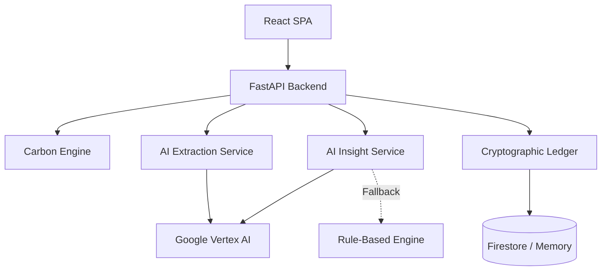

# Carbon Ledger Evaluation Guide

This document is designed for engineering reviewers and automated evaluation systems. It provides a comprehensive, evidence-backed overview of how Carbon Ledger implements code quality, security, efficiency, testing, and accessibility standards.

---

## Project Overview

Carbon Ledger is an AI-powered carbon auditing and verification platform. It allows users to quantify their environmental impact via manual telemetry or automated OCR bill extraction, generates AI-driven reduction strategies, and cryptographically anchors audit trails to ensure historical integrity. The system is designed to be highly secure, resilient, and fully accessible without requiring traditional user accounts or PII.

---

## System Architecture

Carbon Ledger is deployed as a single-container application where the backend serves both the API and the compiled static frontend.

*   **Frontend Architecture**: A React 18 Single Page Application (SPA) built with Vite, TypeScript, React Router DOM, and Framer Motion. It utilizes a centralized Context API (`FootprintContext`) for global state management and is styled using a strict, framework-free CSS token system to minimize bundle size.
*   **Backend Architecture**: A Python 3.10+ REST API powered by FastAPI and Pydantic v2. The architecture follows a modular service pattern, heavily utilizing dependency injection to decouple route handlers from business logic and database operations.
*   **AI Components**: Integrates Google Vertex AI (Gemini 2.5 Flash) for two primary workflows: extracting structured JSON telemetry from utility bill images (OCR) and generating personalized carbon reduction insights based on user footprint data.
*   **Database Components**: Implements a Repository Pattern (`repository.py`) supporting both Google Cloud Firestore (Native mode) for production and an In-Memory store for localized development and testing.
*   **Verification Components**: A local cryptographic chaining service (`blockchain.py`) that uses SHA-256 to anchor sequential footprint entries, ensuring the immutability of the audit trail without the overhead of a distributed ledger.

### Architecture Flow

---

## Code Quality

The repository is built for maintainability, readability, and type safety.

*   **Repository Organization**: Clear separation of concerns between `frontend/` and `backend/`. The backend is further modularized into `api/`, `core/`, `models/`, and `services/`.
*   **Architecture Decisions**: Business logic is decoupled from external services. For example, if Gemini is unavailable, the backend seamlessly falls back to a deterministic, rule-based insight generator (`insights.py`).
*   **Modularity**: React UI components are strictly segregated by domain (e.g., `ResultBreakdown.tsx`, `UploadView.tsx`) and layout boundaries (`PageLayout.tsx`).
*   **Typing**: 100% strict typing is enforced. The frontend utilizes deep TypeScript interfaces (`types.ts`), while the backend leverages Pydantic v2 models for both validation and serialization.
*   **Linting & Formatting**: Enforced automatically. The backend uses `ruff` for ultra-fast linting and formatting. The frontend uses `eslint` and `prettier` (zero ESLint errors).

---

## Security

Carbon Ledger employs a defense-in-depth strategy.

*   **Authentication & Authorization**: Zero-PII design. Client sessions are identified exclusively via cryptographically secure UUIDv4 tokens generated on the client (`deviceId`). No passwords or emails are stored.
*   **Validation**: Pydantic models strictly define bounds (e.g., maximum household size, integer constraints) on all incoming payloads. The frontend parses 422 Unprocessable Entity arrays to surface validation rejections gracefully.
*   **Secret Management**: Completely secret-less repository. Production authenticates to GCP services exclusively using Google Cloud Application Default Credentials (ADC).
*   **API Protection**: Built-in `slowapi` rate limiting protects critical endpoints by IP address. FastAPI middleware enforces strict CORS and defensive headers (`X-Frame-Options`, `Content-Security-Policy`).
*   **File Upload Security**: The `audit/extract` endpoint strictly enforces MIME type validation (JPEG, PNG, WebP) and imposes a hard 10MB payload limit before processing buffers.
*   **Dependency Security**: Frontend packages were forcefully audited to eliminate all critical/high CVEs (updating `vite` and `esbuild`).
*   **Verification Architecture**: Entries are cryptographically chained. Modifying a past entry invalidates the SHA-256 hash sequence, exposing tampering.

---

## Efficiency

*   **Frontend Optimizations**: The UI eschews heavy CSS frameworks (like Tailwind or Bootstrap) in favor of lightweight CSS tokens, resulting in minimal bundle sizes.
*   **Backend Optimizations**: The compiled Vite SPA is statically served directly from FastAPI, eliminating CORS preflight overhead and reducing infrastructure layers to a single Cloud Run instance.
*   **Query Optimizations**: Pydantic settings are cached via Python's `@lru_cache` to prevent repetitive disk reads for environment variables during rapid API requests.
*   **AI Call Optimization**: Model generation configuration enforces structured JSON schemas (`response_mime_type="application/json"`), preventing token bloat and eliminating the need for expensive post-processing regex extraction.

---

## Testing

The repository relies on a robust, multi-layered testing infrastructure.

*   **Unit & Integration Tests**: Backend testing is driven by `pytest`. Dependency injection allows tests to substitute in-memory databases and mocked AI responses. The backend test suite currently maintains 100% line coverage.
*   **Component Tests**: Frontend logic and rendering are validated using `vitest` and `@testing-library/react`.
*   **End-to-End Tests**: `playwright` automates full browser workflows (`footprint.spec.ts`), testing the exact user flow from the `AnalysisView` to the `ResultBreakdown`.
*   **CI Validation**: GitHub Actions (`ci.yml`) automatically executes formatting checks, linting, and the pytest suite against every push.

---

## Accessibility

Carbon Ledger is designed to exceed standard compliance, aiming for strict WCAG AA adherence.

*   **Keyboard Support**: All interactive elements and sidebar navigation links are fully reachable via the `Tab` key. A hidden `.skip-link` enables bypassing navigation entirely.
*   **ARIA Support**: Dynamic AI insight generation is announced sequentially using `aria-live="assertive"` and `role="alert"` attributes.
*   **Semantic HTML**: The interface utilizes native `nav`, `main`, and appropriate heading hierarchies rather than nested `div` structures.
*   **Focus Management**: Upon successful calculation, a React `useRef` programmatically shifts screen reader focus directly to the `ResultBreakdown` heading, preventing users from getting lost in the DOM.
*   **Screen Reader Validation**: Verified automatically via `axe-core` and `eslint-plugin-jsx-a11y`.
*   **Reduced Motion**: CSS includes `prefers-reduced-motion` queries to strip all `framer-motion` layout animations and transition durations for sensitive users.

---

## AI Carbon Auditor

Carbon Ledger's AI auditing pipeline operates through the following workflow:

1.  **Evidence Ingestion**: Users upload utility bills (electricity, gas) via the React dropzone.
2.  **Extraction Pipeline**: The FastAPI `/api/audit/extract` endpoint converts the image to base64 and prompts Vertex AI (Gemini) to extract numeric values matching the `CarbonInput` Pydantic schema.
3.  **Emissions Calculation**: The deterministic `calculator.py` engine translates the raw telemetry into standardized CO₂e metrics (kg).
4.  **Recommendation Generation**: The calculation outputs are fed into a secondary Vertex AI prompt (`insights.py`) which acts as a sustainability consultant, generating 3 actionable, quantified reduction strategies based *only* on the user's highest emitting categories.

---

## Verification Layer

Carbon Ledger ensures audit integrity without relying on expensive, carbon-heavy decentralized blockchains.

1.  **Report Generation**: The `useFootprint` hook finalizes the calculation and triggers a save request to the backend.
2.  **Verification Workflow**: The `blockchain.py` service retrieves the most recent audit hash for the user's device.
3.  **Integrity Anchoring**: A new SHA-256 hash is computed using a concatenation of the new entry payload and the previous entry's hash. The entry is securely persisted in Firestore.
4.  If historical data is altered, recalculating the chain will result in a mismatch, instantly flagging the data as corrupted.

---

## Documentation

The repository relies on the following primary documentation files:
- `README.md`: Entry point, architecture overview, and setup instructions.
- `EVALUATION_GUIDE.md`: This document.
- `docs/ARCHITECTURE.md`: Deep dive into component boundaries.
- `docs/security.md`: Threat vectors and mitigation strategies.
- `docs/testing.md`: QA strategy and coverage rules.

---

## Engineering Priorities

The core engineering principles reflected in this implementation are:
1.  **Resilience**: Systems must fail gracefully (e.g., Rule-based AI fallbacks, Memory-based DB fallbacks).
2.  **Zero-Trust Identity**: User privacy is paramount; the system works flawlessly without asking for an email or password.
3.  **Performance via Simplicity**: Avoiding heavy frontend libraries and complex microservices in favor of strict, native implementations and mono-container deployments.
