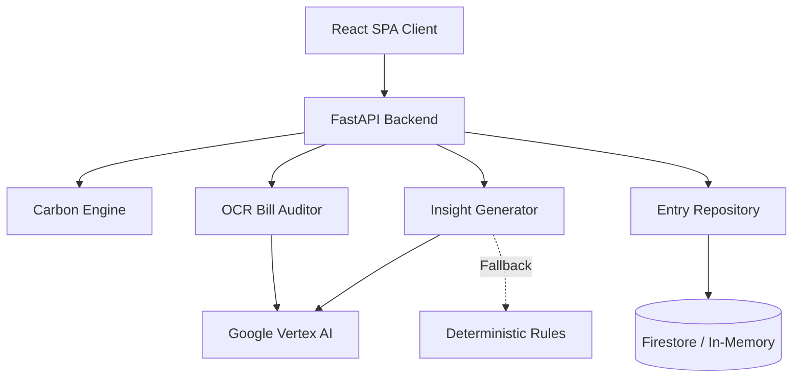
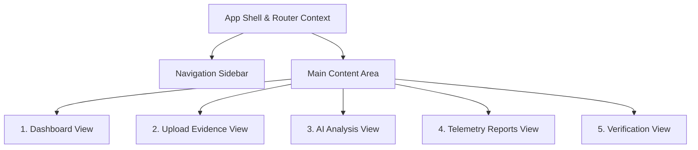

# Carbon Ledger

An elite, privacy-first AI Carbon Auditing Platform that empowers individuals and organizations to calculate, track, and verify their environmental impact through automated data extraction and context-aware insights.


## Overview

Understanding personal carbon emissions is traditionally a complex, manual process requiring specialized knowledge of conversion factors and emission sources. Individuals lack actionable, customized guidance on how to meaningfully reduce their footprint without sifting through generic, untailored advice.

Carbon Ledger bridges the gap between raw consumption data and actionable climate strategies. By translating daily habits—such as transit, diet, and home energy use—into standardized CO₂e metrics, the platform provides immediate visibility into personal climate impact. Users receive dynamically generated, highly personalized reduction recommendations tailored specifically to their highest emission categories.

## Core Features & Capabilities

- **AI-Powered OCR Auditing**: Extracts consumption metrics directly from uploaded utility bills and receipts. The system handles JPEG, PNG, and WebP formats (up to 10MB) and processes them through Google Vertex AI to automatically populate telemetry data.
- **Manual Audit Telemetry**: Accurately models annual emissions across four primary domains: Transport, Home, Diet, and Consumption, utilizing normalized, scientifically-sourced conversion factors.
- **Personalized Reduction Strategies**: Analyzes individual emission breakdowns to generate targeted, quantified reduction advice acting as your personal sustainability consultant.
- **Resilient Fallback Engine**: Maintains core functionality through a deterministic rule-based insights engine if external AI services are unavailable or rate-limited, guaranteeing zero downtime.
- **Cryptographic Verification**: Verifies and logs historical footprint snapshots to local or cloud storage via anonymous UUIDv4 tracking, maintaining an immutable ledger of audits chained via SHA-256 hashes.
- **Privacy-First (Zero PII)**: Operates without requiring user accounts, emails, or passwords. All identity is abstracted to secure client-side generated UUIDs.

## System Architecture

The platform operates as a single-container deployment where the backend serves both the API and the pre-built React frontend.

### High-Level Architecture


### Frontend UI Flow


## Technology Stack

- **Frontend Environment**: React 18, TypeScript, Vite.
- **Frontend Architecture**: React Router DOM for SPA routing, Framer Motion for glassmorphic transitions.
- **Backend Framework**: Python 3.10+, FastAPI, Pydantic v2 (Strict typing boundary).
- **AI Integration**: Google Vertex AI (Gemini 2.5 Flash) via structured JSON prompts.
- **Database Layer**: Repository pattern supporting Google Cloud Firestore (Native mode) with an in-memory local fallback.
- **Infrastructure**: Google Cloud Run, Application Default Credentials (ADC).

## Security & Privacy Considerations

- **Anonymous Identity**: Client sessions are identified exclusively via cryptographically secure UUIDv4 tokens generated on the client.
- **Strict Input Validation**: End-to-end Pydantic validation boundaries reject malformed or extreme inputs before reaching business logic.
- **Rate Limiting**: Built-in `slowapi` rate limiting protects critical endpoints by IP address.
- **Hardened HTTP Headers**: Implements strict CORS origins and defensive headers (`X-Frame-Options`, `Content-Security-Policy`, `Permissions-Policy`) natively via FastAPI middleware.
- **Zero-Secret Deployment**: Leverages Google Cloud Application Default Credentials (ADC), eliminating hardcoded secrets and `.env` files from source control entirely.

## Accessibility (WCAG AA)

- **Semantic Structure**: Built with native HTML5 elements, strict heading hierarchies, and ARIA landmarks.
- **Assistive Technology Integration**: Dynamic content updates (like AI insights) are announced via `aria-live="assertive"` regions. 
- **Keyboard Navigation**: Full tab index support across the sidebar and interactive elements. Programmatic focus management utilizing `useRef` directly routes screen readers post-calculation.
- **Automated Validation**: Integrated `axe-core` and `eslint-plugin-jsx-a11y` to enforce ongoing compliance.

## API Documentation

Once the backend is running, the interactive Swagger UI documentation is automatically generated and available at `/docs`.

### Core Endpoints:
- `POST /api/calculate`: Accepts a `CarbonInput` JSON payload and returns the calculated footprint `FootprintResult` alongside dynamically generated AI `InsightsResponse`.
- `POST /api/audit/extract`: Accepts a multipart/form-data image upload and returns a parsed `CarbonInput` payload.
- `GET /api/entries/{device_id}`: Retrieves the cryptographically verified ledger history for a specific anonymous device.
- `POST /api/entries`: Saves a new calculation entry and chains it to the cryptographic ledger.

## Getting Started

### Local Development

**1. Backend Setup**
```bash
cd backend
python -m venv .venv
source .venv/bin/activate  # Windows: .venv\Scripts\activate
pip install -r requirements-dev.txt

# Run purely locally (in-memory DB, deterministic rules instead of Gemini)
USE_GEMINI=false USE_FIRESTORE=false uvicorn app.main:app --reload
```

**2. Frontend Setup**
*(Note: To bypass Vite's bug with `#` characters in parent directory paths, use the build/preview commands rather than `npm run dev`)*
```bash
cd frontend
npm install
npm run build
npm run preview
```

### Environment Variables

If you wish to run with Google Cloud features enabled, you can configure the following variables (defaults to local-mode if omitted):
- `USE_FIRESTORE` (true/false) - Toggles Google Cloud Firestore.
- `FIRESTORE_PROJECT` - Your GCP Project ID.
- `FIRESTORE_COLLECTION` - The Firestore collection name (default: `footprints`).
- `USE_GEMINI` (true/false) - Toggles Google Vertex AI integration.
- `GEMINI_PROJECT` - Your GCP Project ID.
- `GEMINI_LOCATION` - GCP region for Vertex AI (e.g., `us-central1`).

### Docker Deployment

To deploy the unified container containing both the FastAPI backend and the static Vite frontend:
```bash
docker build -t carbon-ledger .
docker run -p 8080:8080 -e USE_GEMINI=false -e USE_FIRESTORE=false carbon-ledger
```

## Testing Strategy

- **Unit & Integration**: Pytest drives backend validation covering the math engine, validation bounds, routes, and dependency injection overrides. Enforces 100% backend line coverage.
- **Component**: Vitest and React Testing Library assert frontend component logic, API mocking, and automated accessibility checks.
- **End-to-End**: Playwright orchestrates full-flow browser testing (`footprint.spec.ts`) to validate the client-server interaction and routing without manual intervention.

## Design Decisions & ADRs

- **Rule-Based Fallback**: Relying solely on LLMs introduces latency and availability risks. The dual-insight system guarantees the user always receives actionable advice, even when APIs are down.
- **Cryptographic Verification**: Rejected distributed ledger technology in favor of standard SHA-256 cryptographic chaining (`docs/adr/0001-reject-web3-blockchain.md`). This decision eliminates unnecessary carbon emissions and latency while preserving data integrity.

## Future Roadmap

- Implementation of localized emission factors based on geographic IP routing.
- Export capabilities for historical tracking data (CSV/PDF).
- Progressive Web App (PWA) offline support for the tracking dashboard.

## Contribution Guidelines
Please see `CONTRIBUTING.md` for details on our code of conduct, branch naming conventions, and the pull request process.

## License
This project is licensed under the MIT License.
