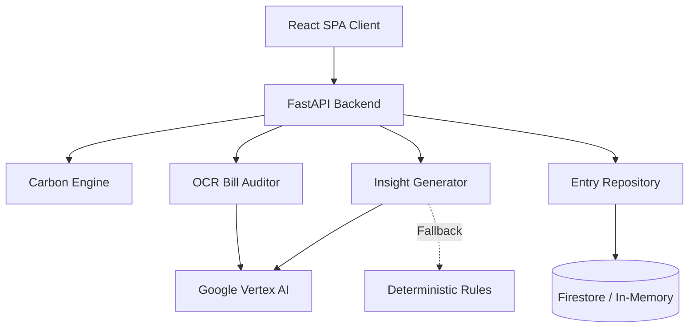
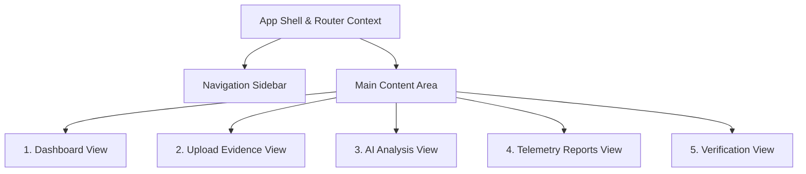

# Carbon Ledger

An elite, privacy-first AI Carbon Auditing Platform that empowers individuals and organizations to calculate, track, and verify their environmental impact through automated data extraction and context-aware insights.

## Problem

Understanding personal carbon emissions is traditionally a complex, manual process requiring specialized knowledge of conversion factors and emission sources. Individuals lack actionable, customized guidance on how to meaningfully reduce their footprint without sifting through generic, untailored advice.

## Solution

Carbon Ledger bridges the gap between raw consumption data and actionable climate strategies. By translating daily habits—such as transit, diet, and home energy use—into standardized CO₂e metrics, the platform provides immediate visibility into personal climate impact. Users receive dynamically generated, highly personalized reduction recommendations tailored specifically to their highest emission categories.

## Key Capabilities

- **AI-Powered OCR Auditing**: Extracts consumption metrics directly from uploaded utility bills and receipts (JPEG, PNG, WebP) up to 10MB.
- **Manual Audit Telemetry**: Accurately models annual emissions across four primary domains: Transport, Home, Diet, and Consumption, utilizing normalized, scientifically-sourced conversion factors.
- **Personalized Reduction Strategies**: Analyzes individual emission breakdowns to generate targeted, quantified reduction advice.
- **Resilient Fallback Engine**: Maintains core functionality through a deterministic rule-based insights engine if external AI services are unavailable or rate-limited.
- **Cryptographic Verification**: Verifies and logs historical footprint snapshots to local or cloud storage via anonymous UUIDv4 tracking, maintaining an immutable ledger of audits.

## System Architecture

The platform operates as a single-container deployment where the backend serves both the API and the pre-built React frontend.

### High-Level Architecture


### Frontend UI Flow


## Technology Stack

- **Frontend**: React 18, TypeScript, Vite, React Router DOM, Framer Motion (Glassmorphic dark UI)
- **Backend**: Python 3.10+, FastAPI, Pydantic (Strict typing)
- **AI**: Google Vertex AI (Gemini 2.5 Flash)
- **Database**: Google Cloud Firestore (Native mode) with in-memory local fallback
- **Infrastructure**: Google Cloud Run, Application Default Credentials

## Security Considerations

- **Anonymous Identity**: Zero-PII design. Client sessions are identified exclusively via cryptographically secure UUIDv4 tokens generated on the client.
- **Strict Input Validation**: End-to-end Pydantic validation boundaries reject malformed or extreme inputs.
- **Rate Limiting**: Built-in `slowapi` rate limiting protects critical endpoints by IP address.
- **Hardened HTTP Headers**: Implements strict CORS origins and defensive headers (`X-Frame-Options`, `Content-Security-Policy`, `Permissions-Policy`) natively via FastAPI middleware.
- **Zero-Secret Deployment**: Leverages Google Cloud Application Default Credentials (ADC), eliminating hardcoded secrets and `.env` files from source control.

## Accessibility

- **Semantic Structure**: Built with native HTML5 elements, strict heading hierarchies, and ARIA landmarks.
- **Assistive Technology Integration**: Dynamic content updates (like AI insights) are announced via `aria-live` regions. 
- **Keyboard Navigation**: Full tab index support across the sidebar and interactive elements.
- **Automated Validation**: Integrated `axe-core` and `eslint-plugin-jsx-a11y` within the CI pipeline to enforce WCAG AA compliance.

## Performance Optimizations

- **Single-Container Deployment**: The Vite-compiled SPA is mounted and served directly from the FastAPI backend, eliminating CORS preflight overhead and reducing infrastructure complexity.
- **Asset Optimization**: Strict CSS tokenization and lightweight animation libraries (`framer-motion`) ensure a highly responsive UI.
- **Configuration Caching**: Backend configuration (`pydantic-settings`) is instantiated using `lru_cache`, preventing redundant disk I/O.

## Testing Strategy

- **Unit & Integration**: Pytest drives backend validation covering the math engine, validation bounds, routes, and dependency injection overrides. Enforces 100% backend coverage.
- **Component**: Vitest and React Testing Library assert frontend component logic, API mocking, and automated accessibility checks.
- **End-to-End**: Playwright orchestrates full-flow browser testing to validate the client-server interaction and routing without manual intervention.

## Getting Started

### Local Development

**1. Backend Setup**
```bash
cd backend
python -m venv .venv
source .venv/bin/activate  # Windows: .venv\Scripts\activate
pip install -r requirements-dev.txt

# Run purely locally (in-memory DB, deterministic rules instead of Gemini)
USE_GEMINI=false USE_FIRESTORE=false uvicorn app.main:app --reload
```

**2. Frontend Setup**
*(Note: To bypass Vite's bug with `#` characters in parent directory paths, use the build/preview commands rather than `npm run dev`)*
```bash
cd frontend
npm install
npm run build
npm run preview
```

### Docker Deployment
```bash
docker build -t carbon-ledger .
docker run -p 8080:8080 -e USE_GEMINI=false -e USE_FIRESTORE=false carbon-ledger
```

## Design Decisions

- **Rule-Based Fallback**: Relying solely on LLMs introduces latency and availability risks. The dual-insight system guarantees the user always receives actionable advice, even when APIs are down.
- **Cryptographic Verification**: Rejected distributed ledger technology in favor of standard SHA-256 cryptographic chaining (ADR-0001). This decision eliminates unnecessary carbon emissions and latency while preserving data integrity.
- **Modern UI Architecture**: Migrated from a single vertical scroll to a strict router-based layout with glassmorphism to better position the product as a professional auditing tool rather than a novelty calculator.

## Future Roadmap

- Implementation of localized emission factors based on geographic IP routing.
- Export capabilities for historical tracking data (CSV/PDF).
- Progressive Web App (PWA) offline support for the tracking dashboard.

## License

This project is licensed under the MIT License.
